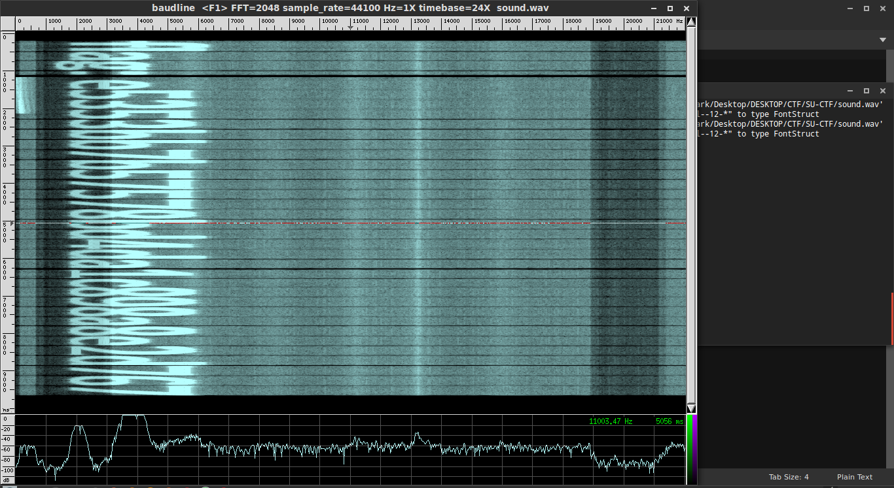

+++
date = '2014-09-28T03:39:00+00:00'
draft = true
title = 'SU-CTF 2014: Steganography 100 write-up'
+++

**Category:** Steganography\
**Points:** 100\
**Challenge Description:**

> "Hear With Your Eyes"

In this challenge, we were given a `.wav` file which we somehow had to decrypt to get the flag.

This was a pretty easy one to be honest. After hearing the audio, the first thing that came to my mind was to use a signal analyser. For this, I used **baudline**. The output was as follows:

**The flag was:** `e5353bb7b575578bd4da1c898a8e2d7667`
