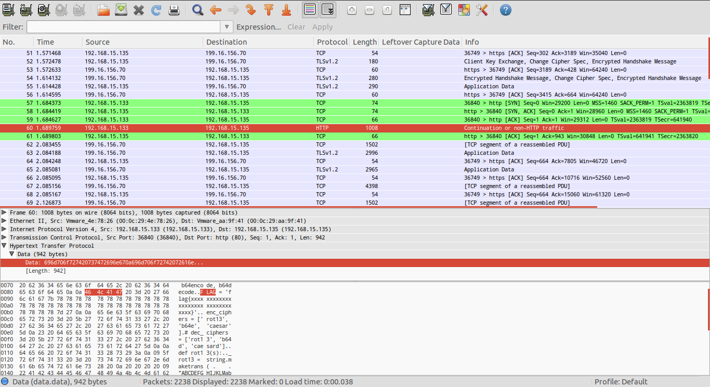

+++
date = '2015-09-20T17:51:00+00:00'
title = 'CSAW CTF 2015 : Forensics 100 Transfer write-up'
url = 'posts/csaw-ctf-2015-forensics-write-up'
+++

**Category:** Forensics\
**Points:** 100\
**Challenge Description:**

> "I was sniffing some web traffic for a while, I think I finally got something interesting. Help me find flag through all these packets.
> [net_756d631588cb0a400cc16d1848a5f0fb.pcap](https://ctf.isis.poly.edu/static/uploads/9816b472715fa536ab95bf43edc10540/net_756d631588cb0a400cc16d1848a5f0fb.pcap)"

Opening it up with Wireshark gives some few HTTP packets. After looking through those packets, I noticed that one of them contains the word FLAG.

The start of the conversation contains a python script and some random padding at the end which was more likely to be the script's output.

Looking through the python script we notice there is a variable called FLAG (censored) that gets encoded with Base64 then looped through one of the following ciphers ROT13, ROT3 and Base64 (randomly chosen).

One thing to mention is that the script keeps the cipher index attached to the encrypted string, this will make it easier for us to reverse the whole thing.



I wrote a quick python script to do the decryption :



Executing the script would give: `flag{li0ns_and_tig3rs_4nd_b34rs_0h_mi}`
