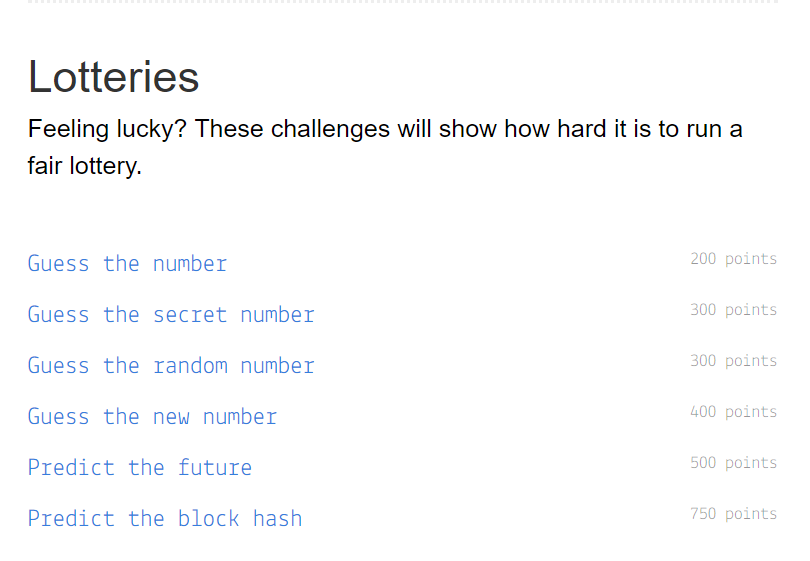

+++
date = '2018-04-16T13:53:00+00:00'
title = 'Capture the Ether: Lotteries write-up'
[[resources]]
+++

[Capture the Ether](https://capturetheether.com/) is a "Capture the Flag" style game where you hack Ethereum smart contracts to learn about security.

## Spoiler Alert!

In this write-up, I will walk through the first four challenges in the "Lotteries" category. Each challenge has its own difficulty level and reward points. The goal is to guess the correct value of a variable defined in a smart contract.

## Guess the number

The smart contract for this challenge looks like this:



It has three functions:

- **`GuessTheNumberChallenge()`**: a payable constructor that tells you how much Ether is required when deploying the smart contract.
- **`isComplete()`**: it returns true when the smart contract's balance is equal to `0`.
- **`guess(uint8 n)`**: It takes a `uint8` as an argument and compares it with the variable declared in line 4. If the numbers are equal, you will have your Ethers sent back to your address. Note that this function is payable and requires exactly 1 Ether to be sent when making a call.

Obviously, all we have to do is invoke `guess()` with `42` as an argument. I used [Web3.js](https://github.com/ethereum/web3.js/) (Ethereum JavaScript API) and [MetaMask](https://metamask.io/) for this.

First you'll need to get the smart contract's [ABI](https://github.com/ethereum/wiki/wiki/Ethereum-Contract-ABI) which will be used to create a contract. the [Remix](http://remix.ethereum.org/) IDE will provide you with everything you need to get this done.

Paste in the code shown bellow and click on "Details".

You can then copy the ABI by clicking on the clipboard icon.

Remember that you can still use [Remix](http://remix.ethereum.org/) to compile, deploy and interact with your smart contracts without having to write any code. I kinda preferred using Web3.js because it's more robust.

The final code to invoke the `guess()` function should look like this:



Notice that the transaction must have exactly 1 ether (`1e18` wei) in its value field, otherwise it would fail.

Clicking the "Check the solution" button in the game should show this (nice pixel art btw):

## Guess the secret number

The code for this challenge is as follow:



The challenge says :

Same as the previous challenge, but this time we need to find a number that was hashed using the [Keccak-256](https://keccak.team/) hashing algorithm.

By looking at the code, you'll notice that `guess()` takes a `uint8` parameter, and according to the [documentation](http://solidity.readthedocs.io/en/v0.4.21/types.html#type-deduction), the highest value of this type is smaller than `2000`. Makes things easier, right?

Now we know that the number we're looking for is less than `2000`, we'll need to write a quick script to brute force it.

Here is what I came up with :



Executing it would give `170` as an answer:

## Guess the random number

The smart contract given in this one looks like this :



As you can see, the answer this time is generated based on the hash of the parent block `block.blockhash(block.number - 1)` and `now` which is simply an alias for `block.timestamp` (current block timestamp). The result keccak256 hash is then being casted to `uint8`.

Our smart contract was deployed to address `0xd5Ce10BE3745114aABf0382556439bA3Ecb2a524`. We can easily lookup the block number in which the transaction was included using Etherscan.

Here is the script I used to calculate the answer using the appropriate parent hash and timestamp :



The answer for this challenge was `73`.

## Guess the new number

In this challenge, the answer is generated on the fly inside the `guess()` function.



We need to guess the block hash and timestamp before our transaction is made, which seems nearly impossible. Note that these two elements can still be influenced to some degree ([more details](http://solidity.readthedocs.io/en/v0.4.21/units-and-global-variables.html#block-and-transaction-properties)), but the solution to this challenge was much simpler than that.

My first approach to solve this was to predict the block timestamp based on the latest block's timestamp and the [average block time](https://etherscan.io/chart/blocktime) which was 14 seconds at the time, and using a higher Gas price to ensure that my transaction is included in the next block.



Unfortunately this didn't work. My transactions always ended up being confirmed 3-5 blocks ahead.

After a few attempts, I realized that I should be doing this from within a smart contract, since we'll have access to the transaction's properties (`block.number` and `block.timestamp`).

Here is the smart contract I made to call `guess()` from the `GuessTheNewNumberChallenge` contract with the correct values:



Notice that I have declared an unnamed `payable` function on line 26. This acts as [fallback function](http://solidity.readthedocs.io/en/v0.4.21/contracts.html#fallback-function) that allows the smart contract to receive Ether through regular transactions. I have also declared a `withdraw()` function to recover my Ethers later.

And voila, it's done.

Well, that’s as far as I got for now. The game was incredibly fun, and I wish I had more free time to keep playing.
